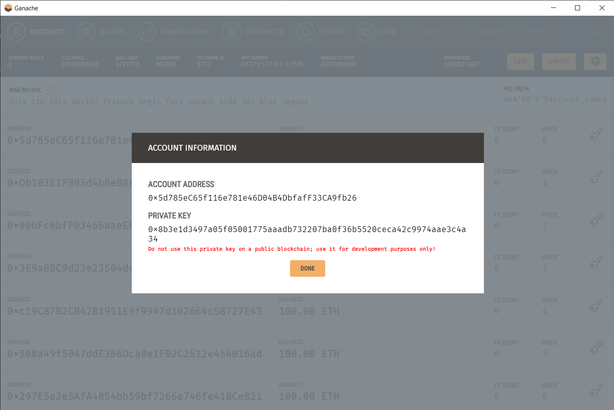

## Blockchain Technologies. Assignment 2: AI Model Marketplace dApp
### Nurlybay Bexultan IT-2205

## Overview

### Connection Setup

1) Install Ganache from the [official website](https://archive.trufflesuite.com/ganache/).
2) Run Ganache and choose quickstart option.
3) Connect to your metamask:
* Add testnet network to metamask.

* Import the account into metamask by copying the private key from Ganache accounts.


### Smart Contract Deployment
1) Go to project directory (AI-Model-Marketplace-dApp), and install all dependencies:
```
$ npm install
```
2) Compile the smart contract:
```
$ truffle compile
```
3) Migrate the smart contract:
> [!NOTE]
> Ganache must be launched
```
$ truffle migrate
```
4) Copy the contract address from an output of previous "truffle migrate" command, and put the address of contract to variable called "contractAddress" in file src/js/contract.js:
```js
const contractAddress = 'put contract address here';
let web3;
let contract;

async function connectWeb3() {
    /* code */
}
```

### Run Website
1) run local server and open it in browser:
```
$ http-server
```
2) navigate to src.


3) You are on the site. Now you can try to create, buy and evaluate models, as well as withdraw accumulated ether.